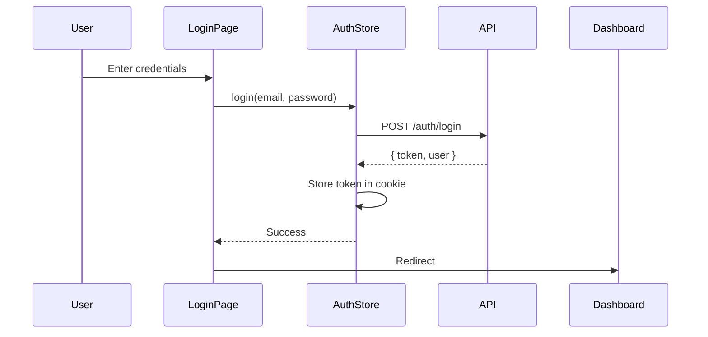
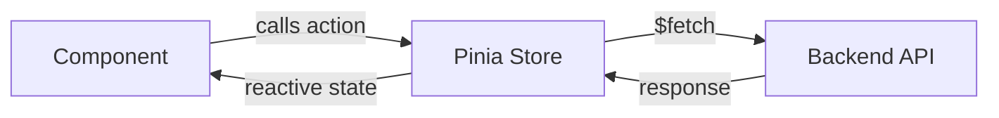

# Frontend Flow & Architecture

This document describes how data flows through the frontend application and how components interact.

## Authentication Flow



## Data Flow Pattern

### API → Store → Component

1. **Component** mounts and calls store action
2. **Store** makes API request via `$fetch`
3. **API** returns data
4. **Store** updates reactive state
5. **Component** reacts to state change



## Key Components

### Layout Structure

```
DefaultLayout
├── AppHeader
│   ├── Navigation
│   └── UserMenu
├── AppSidebar
│   └── NavLinks
├── MainContent (slot)
└── AppFooter
```

### Dashboard Page

```
DashboardPage
├── StatsCards
│   ├── TotalBackups
│   ├── StorageUsed
│   └── ActiveNodes
├── RecentBackups
│   └── BackupTable
└── QuickActions
```

## State Management

### Stores Overview

| Store | Purpose | Key State |
|-------|---------|-----------|
| `auth` | Authentication | `user`, `token`, `isLoggedIn` |
| `nodes` | Node management | `nodes`, `selectedNode` |
| `backups` | Backup operations | `backups`, `backupStatus` |
| `storage` | Storage providers | `providers`, `summary` |

### Store Pattern

```typescript
// stores/example.ts
export const useExampleStore = defineStore('example', () => {
  // State
  const items = ref<Item[]>([])
  const loading = ref(false)
  const error = ref<string | null>(null)

  // Getters
  const activeItems = computed(() => items.value.filter(i => i.active))

  // Actions
  async function fetchItems() {
    loading.value = true
    error.value = null
    try {
      const data = await $fetch('/api/items')
      items.value = data
    } catch (e) {
      error.value = e.message
    } finally {
      loading.value = false
    }
  }

  return { items, loading, error, activeItems, fetchItems }
})
```

## API Integration

### Base Configuration

API base URL is configured in `nuxt.config.ts`:

```typescript
runtimeConfig: {
  public: {
    apiBase: process.env.NUXT_PUBLIC_API_BASE || 'http://localhost:8000'
  }
}
```

### Authenticated Requests

All authenticated requests attach the Bearer token from auth store:

```typescript
const token = useCookie('auth_token')

const data = await $fetch('/api/endpoint', {
  baseURL: config.public.apiBase,
  headers: {
    Authorization: `Bearer ${token.value}`
  }
})
```

## Routing

### Protected Routes

Routes under `/dashboard/*` require authentication via `auth` middleware:

```typescript
// middleware/auth.ts
export default defineNuxtRouteMiddleware((to) => {
  const auth = useAuthStore()
  if (!auth.isLoggedIn) {
    return navigateTo('/login')
  }
})
```

### Route Structure

```
/                    # Landing page (public)
/login               # Login page (public)
/register            # Registration (public)
/forgot-password     # Password reset (public)
/dashboard           # Main dashboard (protected)
/dashboard/nodes     # Node management (protected)
/dashboard/backups   # Backup management (protected)
/dashboard/storage   # Storage providers (protected)
/dashboard/users     # User management (protected, admin only)
/dashboard/settings  # User settings (protected)
```

## Component Communication

### Props Down, Events Up

```vue
<!-- Parent -->
<ChildComponent 
  :data="parentData"
  @update="handleUpdate"
/>

<!-- Child -->
<script setup>
const props = defineProps<{ data: DataType }>()
const emit = defineEmits<{ update: [value: string] }>()
</script>
```

### Global State

For cross-component state, use Pinia stores:

```typescript
// Any component
const store = useExampleStore()
store.fetchData()
```

## Error Handling

### Component Level

```vue
<template>
  <div v-if="error">
    <UAlert color="red" :title="error" />
  </div>
  <div v-else-if="loading">
    <USkeleton class="h-8 w-full" />
  </div>
  <div v-else>
    <!-- Content -->
  </div>
</template>
```

### Global Error Boundary

See `app/error.vue` for global error handling.
